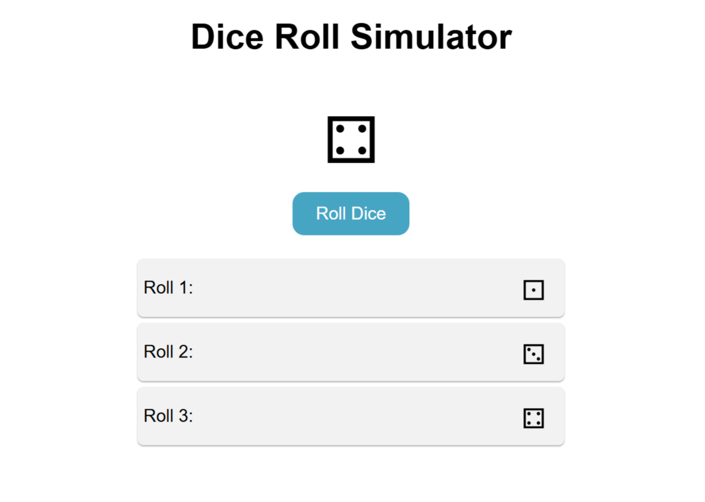

# 🎲 Dice Roll Simulator  

A simple **Dice Roll Simulator** built using **HTML, CSS, and JavaScript**.  
This project simulates rolling a dice and displays a random number (1–6) with each roll.  

---

## 🚀 Features  

✔️ Click button to roll the dice  
✔️ Generates random number between **1 to 6**  
✔️ Shows dice image according to number  
✔️ Simple and responsive design  

---

## 🛠️ Tech Stack  

- **HTML5**  
- **CSS3**  
- **JavaScript (Math.random)**  

---

## 📸 Screenshot  

---
